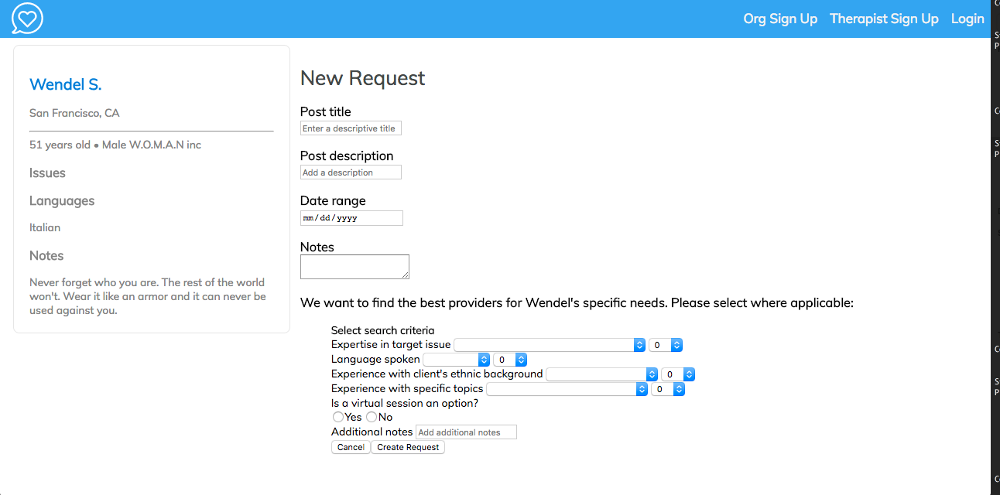
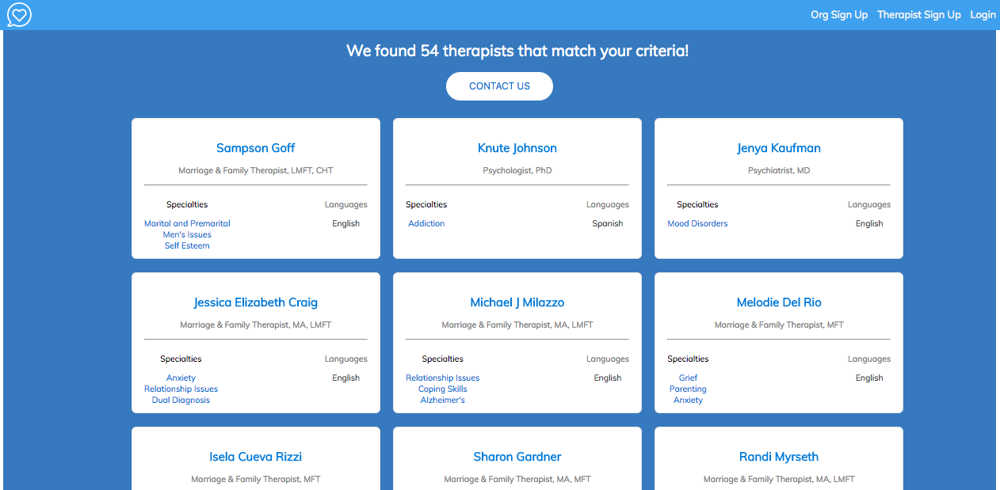

# StepUp

<a href="http://www.github.com/thefirststeph">Team Github</a>

## Story

StepUp was a submission to the Hack for Humanity Hackathon on 7/8-7/9/17. 

### Inspiration

Nonprofits today face many challenges - volunteerism is decreasing, but needs of the people supported by nonprofits are complex and growing, especially in areas such as mental health. So many underserved individuals have to cope with not just day-to-day struggles but also long-term impact on their mental health.

Being able to get more mental health providers to volunteer their services can generate huge, immediate impact. Mental health professionals also come from a culture of volunteering and giving back - so what's keeping people from volunteering?

Biggest reason is NOT time or money but lack of drive. Motivation drops when people feel like they are not really making a difference - key drivers include: lack of responsibility or flexibility, no sense of how they're contributing, wasted time on unproductive or unengaging tasks that don't leverage their skills or expertise.

## Introducing StepUp

#### A platform for nonprofits to identify and target specific mental health providers who are more likely to donate their time to clients in need

StepUP aims to deliver much higher volunteer engagement and retention by:

* Increasing responsibility and tailoring assignments to volunteer interest and expertise
* Increasing flexibility (by leveraging technology for remote sessions)
* Tracking and showing the positive impact that these volunteers are generating

### StepUp

StepUp

A Ruby on Rails application that allows for interaction between nonprofits and mental healthcare providers. Both parties are able to register through our website and work together to assist patients with mental health issues. Additionally, organizations are able to utilize the StepUp Search API through the search function available on this application. As shown below, users of this application can send search requests to find the best available mental healthcare professional to suit a need.

### StepUp Search API

A Ruby on Rails API that returns a list of mental healthcare providers once provided with input parameters such as location, language preference, and primary mental health concerns. The API utilizes a ranking algorithm based on the parameters to return the most relevant mental healthcare providers. This application generates its database utilizing the StepUp Scraper API we built. Using the StepUp Scraper API, the database can be expanded on a regular basis to account for new territories.

### StepUp Scraper API

A Sinatra (Ruby) API that gathers readily available information for mental healthcare providers from PsychologyToday (no API available) utilizing webscraping techniques (Nokogiri) and renders the data in a JSON format.
